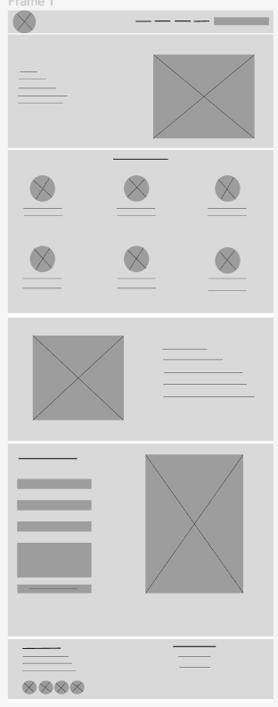

# Web-Book-Club

## Front end
### This website offers book searches using API.

- This web application consists of a navigation bar and several section and footer.
- This section group shows us what this web can offer in the coming days. You can now search for the books you want.
- On the web I used the **Google Book APIs** to fetch a huge collection of books through this API.
- I used **HTML, CSS and JavaScript** to create this web.
- It is also **responsive** with several sizes, namely desktop or mobile phone.

## Figma
- I drew this drawing using figma.
- URL: [Figma](https://www.figma.com/file/UTxBvQexpyjPqWTLc1iTLE/Web-Book-Club?node-id=0%3A1&t=WVkKSopkxNWbAKLD-1)

